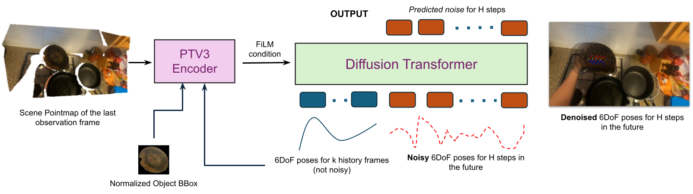

# ObjectForesight

**Predicting future 3D object trajectories from human videos.**

[](https://arxiv.org/abs/2601.05237)
[](https://huggingface.co/raivn/ObjectForesight-EPIC-DiT)
[](https://huggingface.co/datasets/raivn/ObjectForesight-EPIC)

ObjectForesight is a 3D object-centric dynamics model: given a single egocentric observation — a scene point cloud and an object's recent 6-DoF pose — it predicts the object's **H future 6-DoF poses**. This repo is the **model code** (training, evaluation, inference). The data-curation pipeline that produces the training data lives in a separate repo, [RustinS/ObjectForesight-Data](https://github.com/RustinS/ObjectForesight-Data); the extracted dataset and pretrained weights are on Hugging Face.



`PoserV1` = **PointTransformer V3 scene encoder** (via [Sonata](https://github.com/facebookresearch/sonata)) **+ a DiT diffusion temporal head**. Each predicted pose is a 9-D token `[t_x, t_y, t_z, rot6d(6)]`; the 6-D rotation maps to SO(3) via Gram–Schmidt.

| | |
|---|---|
| Encoder | PTv3, `embed_dim=768`, `in_channels=6` (camera-xyz ⊕ object-centric-xyz), `attn_obj` pooling |
| Temporal head | DiT, 12 layers / 768-d / 12 heads, `adaln_zero` conditioning, cosine β-schedule, **v**-prediction, 50 DDIM steps |
| I/O | scene point cloud `[N,3]` + `context_len` past poses → `[H, 9]` future poses |
| Params | ~183 M |

### Results (EPIC-KITCHENS-100)

6-DoF trajectory metrics from the [paper](https://arxiv.org/abs/2601.05237) (lower is better). ADE/FDE = average/final translation error (m); ARE/FRE = average/final rotation error (°).

| Model | ADE ↓ | FDE ↓ | ARE ↓ | FRE ↓ |
|---|---|---|---|---|
| **ObjectForesight-DiT** (this model) | **0.019** | **0.035** | **7.98°** | 13.93° |
| ObjectForesight-AR (baseline) | 0.067 | 0.074 | 9.48° | 12.58° |

See the paper for the full table (DES/RES error-growth slopes, HOT3D, and the video-generation comparison).

---

## Setup

Requires **Python 3.11**, **CUDA 12.x** (with `nvcc` on `PATH`), and a **GPU** — the PTv3 encoder depends on `spconv` + `torch-scatter`, which are compiled from source.

```bash
# 1. install uv (https://github.com/astral-sh/uv) if needed
curl -LsSf https://astral.sh/uv/install.sh | sh

# 2. one-command setup (run on a GPU node; ~20–30 min, builds CUDA packages from source)
./scripts/setup.sh                 # H100/H200 (sm_90) by default
./scripts/setup.sh --cuda-arch 89  # e.g. RTX 40-series (Ada)
./scripts/setup.sh --skip-gpu      # CPU-only (no spconv/flash-attn; for editing/CI)
```

`setup.sh` creates `.venv` (uv, Python 3.11), runs `uv sync` for the base deps, then builds `torch-scatter`, `flash-attn` (optional — the code falls back to PyTorch SDPA if absent), `pytorch3d`, and `cumm`/`spconv`. Compiled kernels are JIT-cached in `~/.cumm` after the first run.

Run anything with `uv run` (no manual activation needed):

```bash
uv run python -c "import torch, spconv, torch_scatter, src; print('env OK', torch.cuda.is_available())"
```

> Manual install (advanced): `uv venv --python 3.11 && uv sync`, then install `torch-scatter` and `flash-attn` (`--no-build-isolation`) and build `cumm`/`spconv` matching your CUDA/PyTorch — see `scripts/setup.sh` for the exact, patched build steps.

## Pretrained weights

The main EPIC-KITCHENS model (**ObjectForesight-DiT**) is on Hugging Face:

```bash
huggingface-cli download raivn/ObjectForesight-EPIC-DiT --local-dir checkpoints/of-epic-dit
# -> best.pt (repo-native) and model.safetensors (pickle-free)
uv run python -m src.eval_main --config-name epic_eval eval.ckpt=checkpoints/of-epic-dit/best.pt
```

## Data

The extracted trajectories are released as the gated dataset [`raivn/ObjectForesight-EPIC`](https://huggingface.co/datasets/raivn/ObjectForesight-EPIC):

```bash
huggingface-cli download raivn/ObjectForesight-EPIC --repo-type dataset --local-dir of-epic
cd of-epic && python examples/prepare.py    # untar shards -> ./manip_data
```

Point the loader at it with `data.dataset_root=/path/to/manip_data` (default: `./manip_data`). The dataset ships the windowing/filtering loader; this repo's `src/data/` performs the same trajectory construction at train time.

## Usage

All runs are configured with [Hydra](https://hydra.cc/) (`conf/epic.yaml` is the primary config). Override any field on the command line.

```bash
# Train (single GPU)
uv run python -m src.train_main data.dataset_root=/path/to/manip_data

# Train (multi-GPU / Slurm)
uv run torchrun --standalone --nproc_per_node=8 -m src.train_main
bash scripts/submit.sh --nodes 1 --gpus-per-node 8

# Evaluate (paper-style filtered eval) / infer / visualize with a checkpoint
uv run python -m src.eval_main  --config-name epic_eval eval.ckpt=checkpoints/of-epic-dit/best.pt
uv run python -m src.infer_main infer.ckpt=checkpoints/of-epic-dit/best.pt
uv run python -m src.viz_main   viz.save_dir=outputs/overlays

# Quick smoke test (synthetic data, no dataset needed)
uv run python -m src.train_main data.dataset_name=synth data.use_synthetic=true \
  train.tiny_overfit=true train.tiny_n=8 train.epochs=1
```

### Configuration highlights

| Section | Key | Meaning |
|---|---|---|
| `data` | `H`, `context_len`, `n_points` | horizon, # context frames, points sampled from the scene |
| `model` | `temporal_kind` | `dit` (default) or `ar_transformer` |
| `model.temporal_dit` | `conditioning`, `ddim_steps` | `adaln_zero`/`film`, # sampling steps |
| `train` | `batch_size`, `lr`, `amp`, `ema` | standard training knobs |
| `eval` | `eval_mode`, `steps`, `prefer_ema` | sampler vs loss eval, DDIM steps |

## Repository structure

```
src/
├── models/poser_v1/   # PoserV1 (PTv3 encoder + DiT/AR temporal head)
├── encoders/          # PointTransformer V3 adapter + serialization
├── temporal/          # DiT diffusion (DDIM) and AR transformer
├── data/              # dataset loaders, windowing, point-cloud / pose IO
├── geom/              # SE(3) ops, 6-D rotation, pose canonicalization
├── dist/              # DDP / FSDP launch
└── utils/             # config adapter, normalization, logging
conf/                  # Hydra configs (epic.yaml [primary], default.yaml, epic_eval.yaml)
scripts/               # setup.sh, submit.sh, preprocessing utilities
```

## Citation

```bibtex
@article{soraki2026objectforesight,
  title   = {ObjectForesight: Predicting Future 3D Object Trajectories from Human Videos},
  author  = {Soraki, Rustin and Bharadhwaj, Homanga and Farhadi, Ali and Mottaghi, Roozbeh},
  journal = {arXiv preprint arXiv:2601.05237},
  year    = {2026}
}
```

## License & acknowledgments

Code released for non-commercial research use. The dataset and weights are derived from **EPIC-KITCHENS-100** (CC BY-NC 4.0) — cite EPIC-KITCHENS-100 and comply with its [terms](https://epic-kitchens.github.io) when using them.

Built on [PointTransformer V3 / Sonata](https://github.com/facebookresearch/sonata), [Hydra](https://hydra.cc/), and [PyTorch](https://pytorch.org/).
